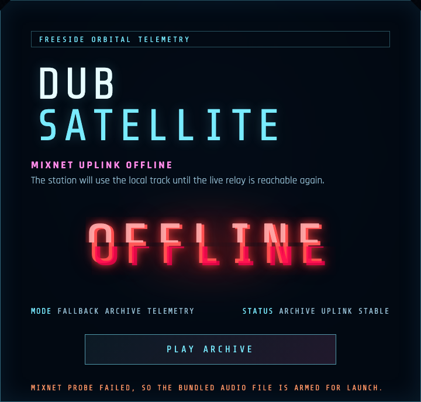
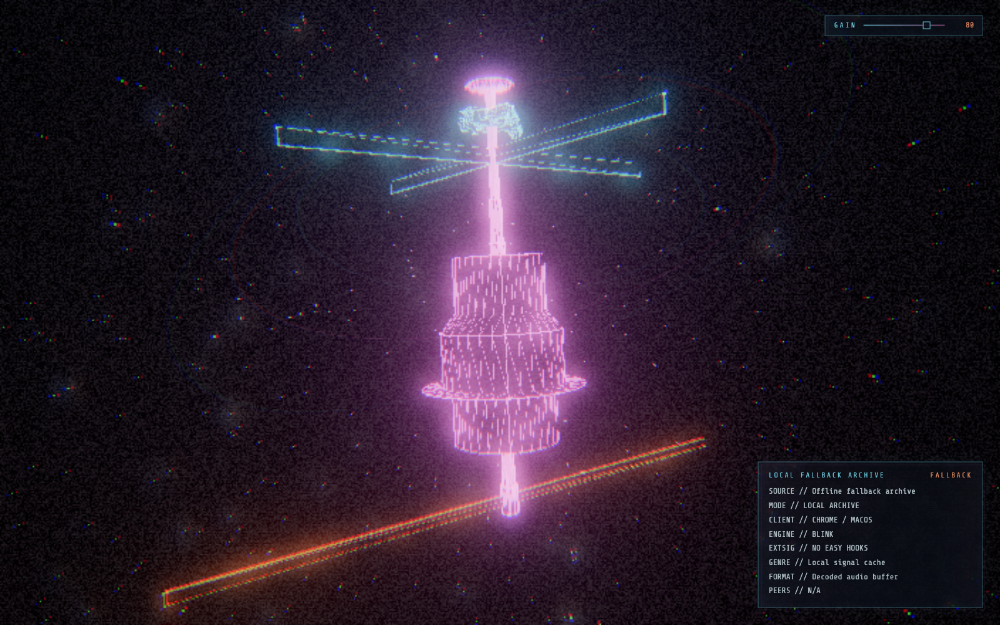
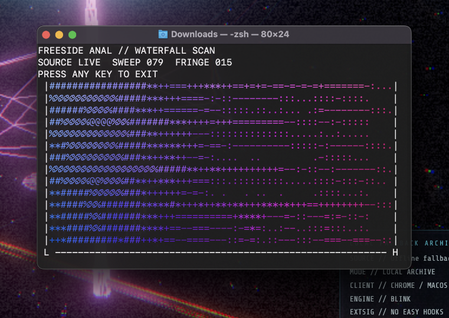
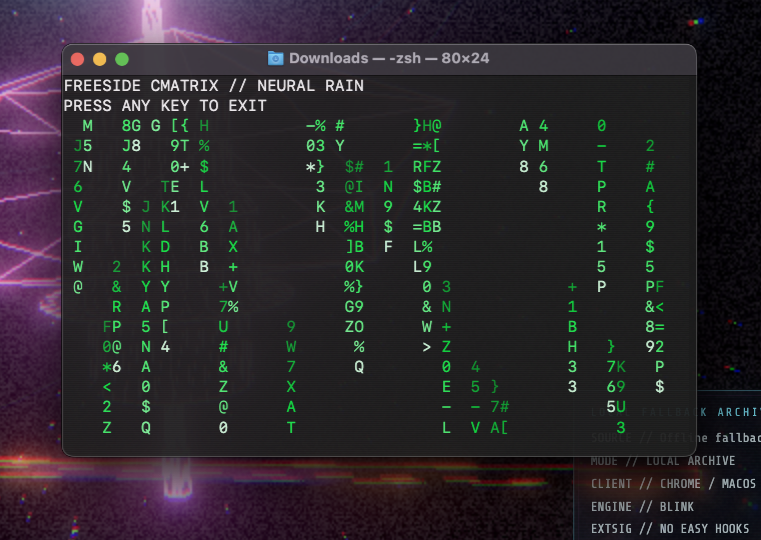
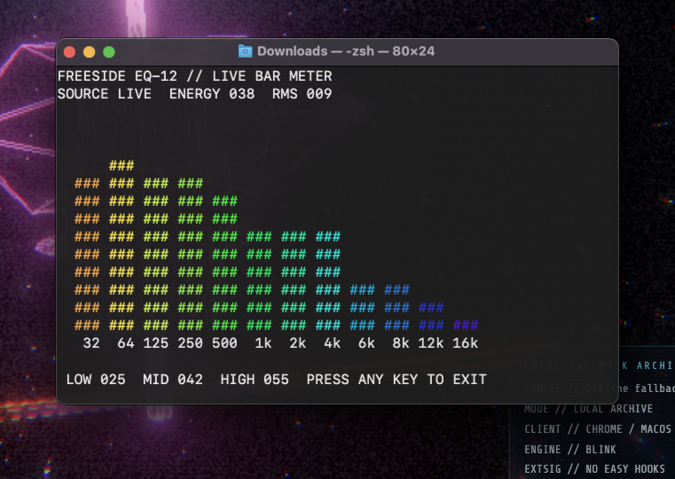
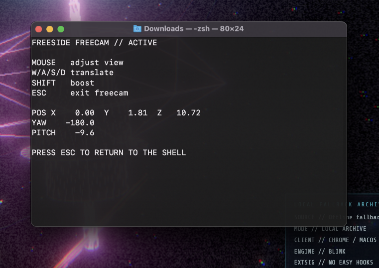
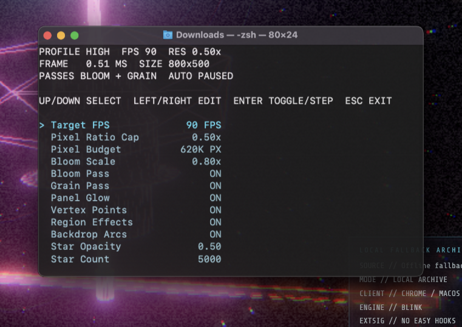

# freeside-dub

microsite repo for dub.freeside.ltd. 

## Quick start

```bash
npm install
npm run dev
```

Other useful commands:

| Command | What it does |
| --- | --- |
| `npm run dev` | Start the local Vite dev server |
| `npm run build` | Production build |
| `npm run lint` | JS linting |
| `npm run screenshots` | Regenerate the README screenshots |

There are no app tests. Right now the practical testing flow is **lint + build + a quick manual pass in dev** and the automated screenshots.

## Screenshots

| Launch dialog | Started scene |
| --- | --- |
|  |  |

### Boot terminal variants

| Windows | macOS | Linux |
| --- | --- | --- |
|  |  |  |

### "Terminal apps"

because toy control surfaces are fun.

| `./anal` | `./cmatrix` | `./eq` |
| --- | --- | --- |
|  |  |  |

| `./freecam` | `./fx` |
| --- | --- |
|  |  |

## Project shape

| Path | Role |
| --- | --- |
| `src/audio.js` | audio engine |
| `src/events.js` | shared transient runtime state (vfx events like `pulse`, `fringe`, hits, energy, etc.) |
| `src/scene.js` | scene bootstrap, renderer/composer setup, and frame updates |
| `src/scene/` | visuals & interactive hook logic, model loading, wire/panel/effect overlays, scene styling |
| `src/cmd/` | command terminal commands and mini-apps like the spectral analyzer |
| `src/terminal.js` | generic terminal windowing implementation and OS chrome variants |
| `public/` | runtime assets: `station.glb`, `audio.ogg`, terminal frame images, favicons |
| `docs/screenshots/` | generated screenshots from the capture script |

## Runtime flow

1. `main.js` builds the runtime profile, creates `SpaceStationScene`, and probes the live stream status endpoint.
2. if the relay is reachable, the app uses the live stream. if not, it falls back to `/audio.ogg`.
3. nothing actually starts playing until the user clicks the start button. keep that click gate in place or browser autoplay restrictions slime you out (thanks).

## Controls

These only matter after you have started playback.

| Control | Effect |
| --- | --- |
| `c` | Toggle the command terminal |
| `w` / `m` / `l` | Spawn Windows / macOS / Linux boot terminal variants |

## Screenshot workflow

`npm run screenshots` does a few things for you:

- starts a local Vite server on `127.0.0.1:4173`
- forces the bundled audio fallback so capture runs are predictable
- resets the local storage bits that affect boot terminal visibility and volume
- captures the launch overlay, started scene, runtime HUD, all terminal apps, and a GIF for each terminal style
- writes the output into `docs/screenshots/`

If Playwright ever complains that Chromium is missing, run this once:

```bash
npx playwright install chromium
```

## A couple of gotchas

- the app deliberately stores a few things in `localStorage`, including volume and whether the sketchy terminal sequence has already been shown before.
- the live stream probe makes real network requests to a real icecast server. if it fails, the fallback path is expected behavior so that the effects can be viewed regardless.
- the terminal stuff is intentionally stylized sketchy.
- tick update ordering matters: `audio.update()` -> `events.update(dt)` -> `scene.update()`.
